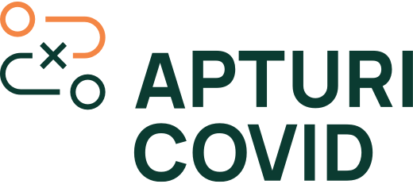
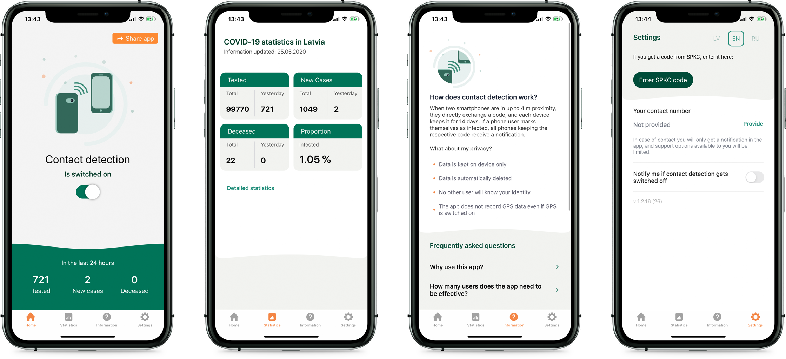

This source code is a property of [Centre for Disease Prevention and Control (CDPC) of Latvia](https://spkc.gov.lv/). You are free to use it accordingly to the Licence terms, and we would like to hear from you if you find it useful. Please drop us an email to: pasts@spkc.gov.lv

# SPKC Apturi Covid iOS Application

This project's goal is to delay and mitigate the impact of SARS-CoV-2 by developing the official Apturi Covid (Stop Covid) iOS application for the Republic of Latvia, utilising Apple's [Exposure Notification](https://developer.apple.com/documentation/exposurenotification) Framework.

### Usage of the Exposure Notification Framework

Only approved health authorities can access these APIs. Therefore, framework calls will result in API error unless the entitlement - `com.apple.developer.exposure-notification` is granted to the application by Apple. The minimum deployment target is iOS 13.5 due to the availability of the Framework.

## How it works

Application functionality is based on Apple's Exposure Notification Framework. Application directly is not interracting with Bluetooth LE in any way. The only capabilities application is using are `Background Fetch` and `Background Processing` in order to schedule Exposure Detection against the Framework in the background. Bluetooth key transmission and receiving is handled entirely by EN Framework. Please [read more here](https://developer.apple.com/documentation/exposurenotification) regarding the implementation specifics of the Framework.

Application communicates with the server and exchanges information only to perform the following actions:
1. Phone number verification (with user consent)
2. Fetching exposure detection configuration. Detailed information [here](https://developer.apple.com/documentation/exposurenotification/enexposureconfiguration)
3. Downloading publicly available batches of TEKs (Temporary Exposure Keys)
4. Uploading anonymous exposure events (with user consent)

### Exposure Detection

Exposure Detection is performed at every application launch and in the background scheduled by BGTaskScheduler. Application stores last analysed batch index and at every task launch checks for new batches available and performs analysis.

Exposure Manager is the class that is responsible for the entire exposure detection. For more details please check `ExposureManager.swift`

## Development
1. Install Xcode 11.5 or higher
2. Make sure you have CocoaPods installed: [installation instructions](https://cocoapods.org)
3. Install pods
> `pod install`
4. Add Firebase configuration
> Place your `GoogleService-Info.plist` under the following directories: `/environments/staging` `/environments/production`
5. In case you are not an entitled authority and do not have `com.apple.developer.exposure-notification` - remove these entitlements from an according target.

## Support & Feedback

Contributions and feedbacks are always welcome. If you have encountered and issue, have an improvement in mind or an implementation question, please use the issues section.

### Vulnerability reporting
If you believe you have found a security vulnerability, please submit your report to us as described in the issues section.

## License

This work is licensed under [Creative Commons Attribution-ShareAlike 4.0 International](https://creativecommons.org/licenses/by-sa/4.0/)

## Contributors ❤️✨

   
